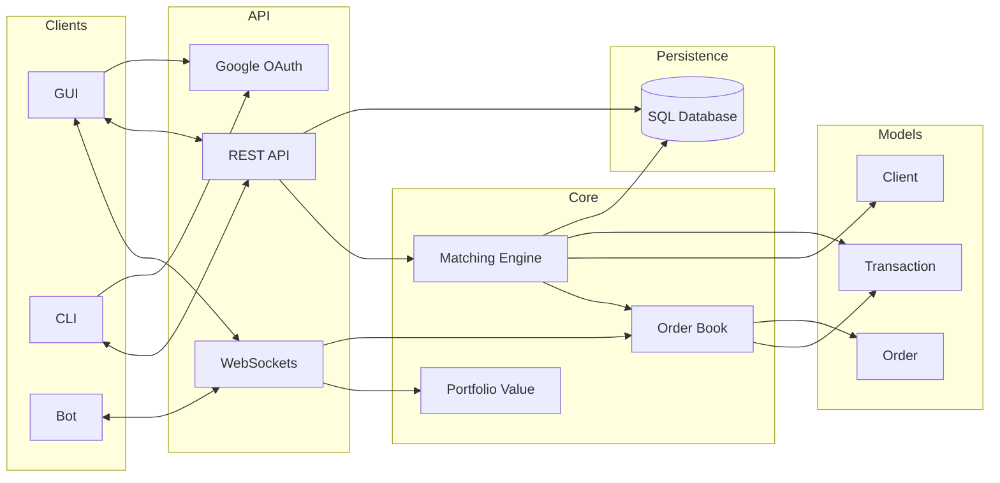

# Stock Market Demo

Local stock market simulation built with FastAPI, a browser frontend, and an in-memory matching engine backed by SQLite persistence. The project is set up for deterministic demos: seeded accounts, local websocket endpoints, and a smoke script that refuses to kill unrelated processes.

## What it does

- Matches limit and market orders for `OGC`, `FIN`, and `DTC`
- Streams market data over `/ws`
- Streams per-client balance and portfolio updates over `/client_info`
- Persists open limit orders across app restarts
- Serves a browser demo UI from `/app`
- Includes a pytest suite for unit, API, and integration coverage

## Stack

- Backend: FastAPI
- Matching engine: custom in-memory order book and matcher
- Persistence: SQLite
- Frontend: static HTML/CSS/JavaScript served by FastAPI
- Tooling: `uv`, `pytest`

## Quick start

```bash
uv venv
source .venv/bin/activate
uv sync
uvicorn app:app --host 127.0.0.1 --port 8000 --reload
```

Open `http://127.0.0.1:8000/app`.

The API is available under `http://127.0.0.1:8000/api/*`.

## Demo accounts

The local demo is seeded from [static/config/shared_constants.json](/Users/arav/git/stock-market/static/config/shared_constants.json).

- `amorgan` / `alex.morgan@demo.local`
- `jlee` / `jordan.lee@demo.local`
- `bot_alpha` / `bot.alpha@demo.local`
- `bot_beta` / `bot.beta@demo.local`

## Local demo flow

1. Start the app locally on port `8000`.
2. Open the frontend at `/app`.
3. Sign in with one of the seeded demo users.
4. Place orders and watch `/ws` and `/client_info` drive the UI in real time.

For a quick backend sanity check:

```bash
bash scripts/smoke_demo.sh
```

The smoke script:

- creates or reuses `.venv`
- syncs dependencies with `uv`
- runs `pytest`
- starts `uvicorn` on `127.0.0.1:8000`
- calls `GET /api/get_best?ticker=OGC`

If port `8000` is already occupied, the script exits instead of killing the existing process.

## API overview

Core order endpoints:

- `POST /api/place_order`
- `POST /api/market_order`
- `POST /api/edit_order`
- `POST /api/cancel_order`
- `GET /api/order_status`
- `GET /api/open_orders`

Market data endpoints:

- `GET /api/get_best_bid`
- `GET /api/get_best_ask`
- `GET /api/get_best`
- `GET /api/get_volume_at_price`
- `GET /api/get_all_bids`
- `GET /api/get_all_asks`
- `GET /api/transactions`
- `GET /prices`
- `GET /api/portfolio_values`

Client/demo endpoints:

- `GET /api/demo`
- `GET /api/get_client_by_email`
- `POST /api/add_new_client`
- `GET /api/client_info_token`

## Identity and websocket auth

Protected REST endpoints use actor headers:

- `X-Actor-User`
- `X-Actor-Email`

At least one actor header must be present for protected actions, and the actor must match the target client.

The `/client_info` websocket is also authenticated. Its first message must be a JSON payload with:

```json
{
  "email": "alex.morgan@demo.local",
  "token": "..."
}
```

The token is obtained from `GET /api/client_info_token` after the REST identity check succeeds.

## Websocket endpoints

- `/ws`: global market stream with best bid/ask, full visible book, last price, timestamps, and pnl summary per ticker
- `/client_info`: authenticated per-client stream with balance, holdings, portfolio value, and pnl data

Frontend websocket addresses are intentionally local-only for deterministic demos.

## Configuration

[static/config/shared_constants.json](/Users/arav/git/stock-market/static/config/shared_constants.json) is the source of truth for:

- identity header names
- frontend websocket addresses
- demo and bot accounts
- tickers and opening prices

Those constants are loaded in backend code through [market_constants.py](/Users/arav/git/stock-market/market_constants.py) and [app/shared_constants.py](/Users/arav/git/stock-market/app/shared_constants.py). [engine/tickers.py](/Users/arav/git/stock-market/engine/tickers.py) remains as a compatibility loader, but the JSON file is the canonical config.

## Project layout

- [app.py](/Users/arav/git/stock-market/app.py): ASGI entrypoint
- [app/main.py](/Users/arav/git/stock-market/app/main.py): app setup, lifespan, static mount
- [app/api.py](/Users/arav/git/stock-market/app/api.py): REST handlers and route registration
- [app/websocket_routes.py](/Users/arav/git/stock-market/app/websocket_routes.py): websocket handlers
- [app/persistence.py](/Users/arav/git/stock-market/app/persistence.py): restore/persist order book state
- [engine/](/Users/arav/git/stock-market/engine): matching engine and order book logic
- [models/](/Users/arav/git/stock-market/models): domain models
- [static/](/Users/arav/git/stock-market/static): frontend app and shared config
- [TradingBot/](/Users/arav/git/stock-market/TradingBot): demo bot clients
- [tests/](/Users/arav/git/stock-market/tests): unit, API, and integration tests
- [scripts/smoke_demo.sh](/Users/arav/git/stock-market/scripts/smoke_demo.sh): end-to-end local smoke script

## Testing

Run the full suite:

```bash
uv run pytest -q
```

Run by layer:

```bash
uv run pytest -m unit -q
uv run pytest -m api -q
uv run pytest -m integration -q
```

## Trading bot

With the server already running:

```bash
uv run python TradingBot/TradingBot.py
```

To run multiple seeded bot profiles:

```bash
uv run python TradingBot/run_demo_bots.py --bot-count 2
```


